# Pocket Casino

Un casino rétro de poche : poker roguelike, blackjack arcade et turbo roulette, dans une seule
application web en pixel art. Une banque unique, trois tables, aucune publicité, aucun argent réel.

[](../../actions/workflows/ci.yml)
[](../../actions/workflows/deploy.yml)


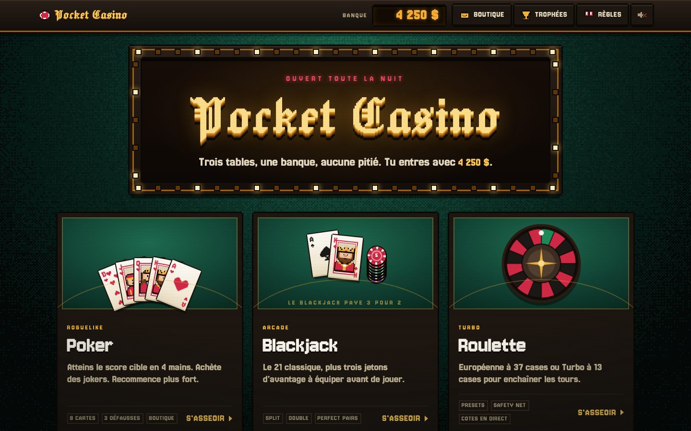

---

## Sommaire

- [Ce que c'est](#ce-que-cest)
- [Démarrage rapide](#démarrage-rapide)
- [Le jeu en images](#le-jeu-en-images)
- [Les trois modes](#les-trois-modes)
- [Économie et progression](#économie-et-progression)
- [Quitte ou Double](#quitte-ou-double)
- [Trophées](#trophées)
- [Direction artistique](#direction-artistique)
- [Architecture du code](#architecture-du-code)
- [Tests](#tests)
- [Intégration et déploiement continus](#intégration-et-déploiement-continus)
- [Scripts npm](#scripts-npm)
- [Accessibilité et confort](#accessibilité-et-confort)
- [Conventions du dépôt](#conventions-du-dépôt)
- [Licence](#licence)

---

## Ce que c'est

Pocket Casino est un jeu de casino solo, hors ligne, sans compte et sans transaction. Les jetons
sont virtuels et la progression tient dans le `localStorage` du navigateur.

Trois tables partagent la même banque, ce qui rend chaque dollar dépensé en boutique arbitrable :
acheter un jeton Peek pour le blackjack, c'est renoncer à un buy-in de poker.

Points de repère techniques :

- React 18 et TypeScript en mode strict, sans framework de composants tiers.
- Zéro dépendance graphique : les cartes, les enseignes, les jetons et les pictogrammes sont des
  sprites pixel art dessinés à la main dans le dépôt, rendus en SVG.
- Zéro fichier audio : tous les sons sont synthétisés à la volée avec la Web Audio API.
- Deux polices auto-hébergées, aucun appel réseau au lancement.
- Générateur pseudo-aléatoire déterministe, ce qui rend les parties et les captures reproductibles.

Bundle de production : environ 76 ko compressés en gzip, polices comprises.

---

## Démarrage rapide

```bash
npm install
npm run dev
```

Puis ouvrir l'adresse affichée dans le terminal, en général `http://localhost:5173`.

Pour rejouer exactement la même partie, passer une graine dans l'URL :

```
http://localhost:5173/?seed=20260727
```

Compilation et prévisualisation du bundle de production :

```bash
npm run build
npm run preview
```

Prérequis : Node 20 ou plus récent.

---

## Le jeu en images

Toutes les captures ci-dessous sont générées automatiquement par
[`scripts/screenshots.mjs`](scripts/screenshots.mjs), qui pilote un Chromium et joue de vraies
parties sur le bundle de production. La graine étant fixe, deux exécutions produisent des images
identiques au pixel près.

### Poker roguelike

Huit cartes en main, quatre mains à jouer, trois défausses. L'aperçu de score se met à jour à
chaque carte sélectionnée.

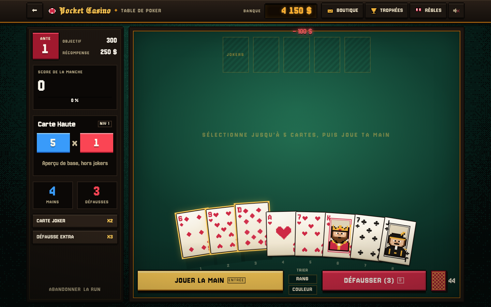

Entre deux manches, la boutique vend des jokers et des niveaux de mains. C'est elle qui rend les
antes suivants atteignables.

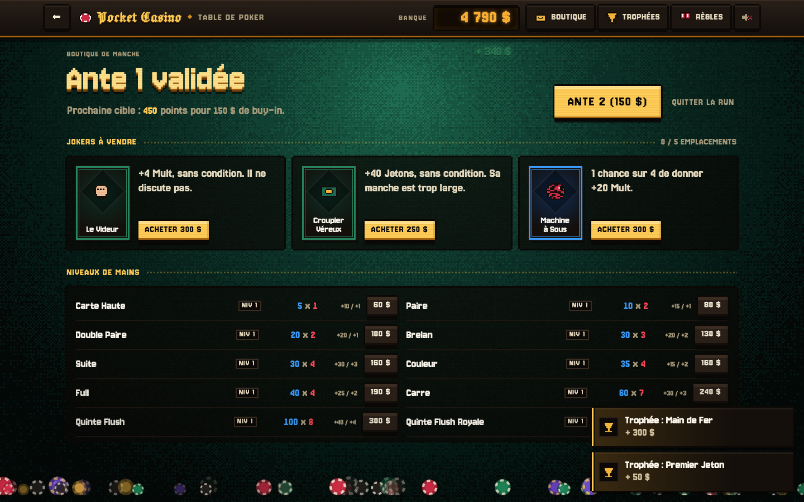

### Blackjack arcade

Le 21 classique, plus les jetons d'avantage à équiper et le pari secondaire Perfect Pairs.

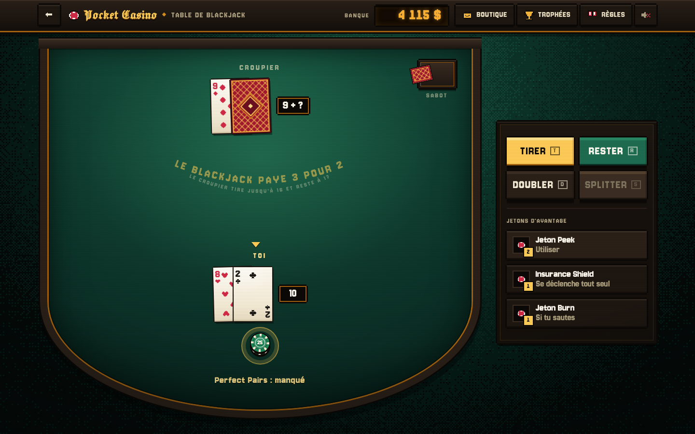

### Turbo roulette

Roue européenne à 37 cases ou roue turbo à 13 cases, avec tapis de mise complet et presets.

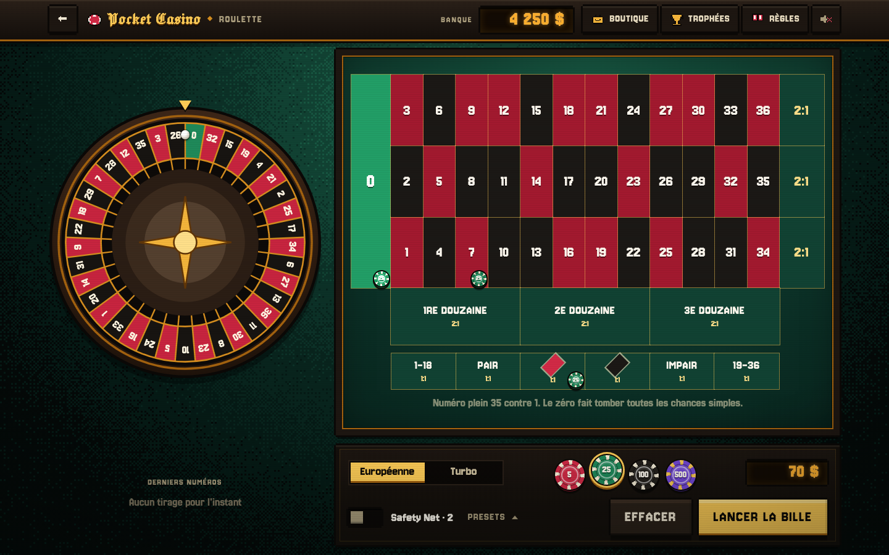

### Quitte ou Double

La mécanique signature : après chaque manche gagnée, tout le retour peut repartir sur une carte
face cachée.

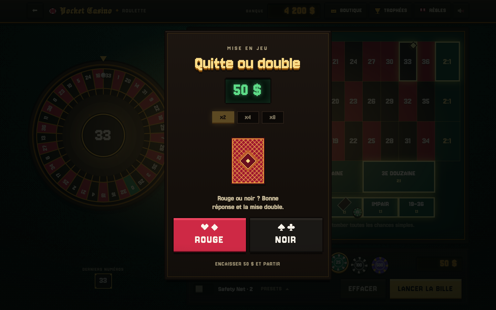

### Carnet de règles

La table de stratégie de base du blackjack est calculée par la fonction `basicStrategy` que le jeu
utilise réellement. La documentation ne peut donc pas se désynchroniser du moteur.

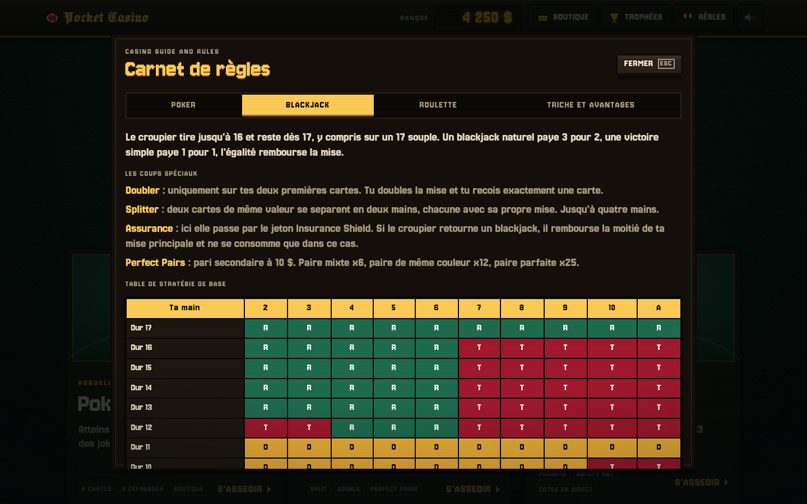

### Trophées

Dix succès, chacun payant une prime directement en banque, exonérée de la taxe de la Mafia.

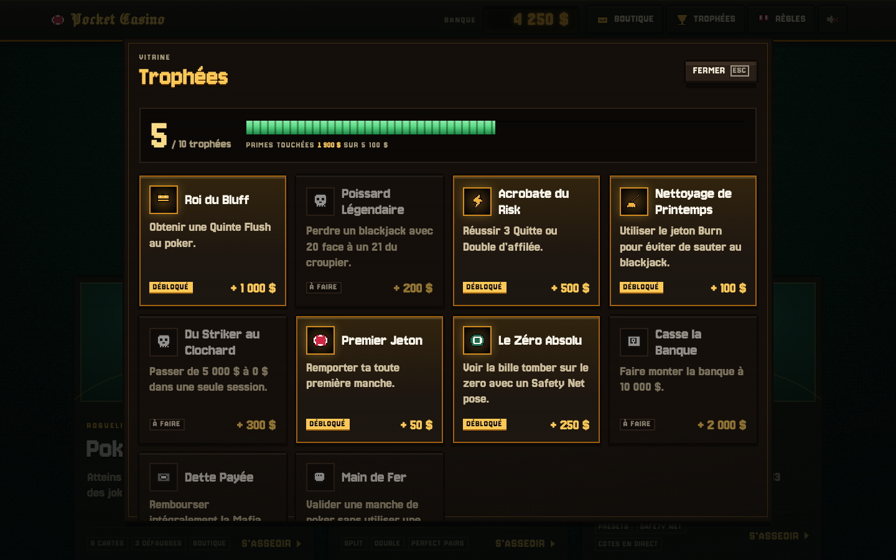

### Magasin d'avantages

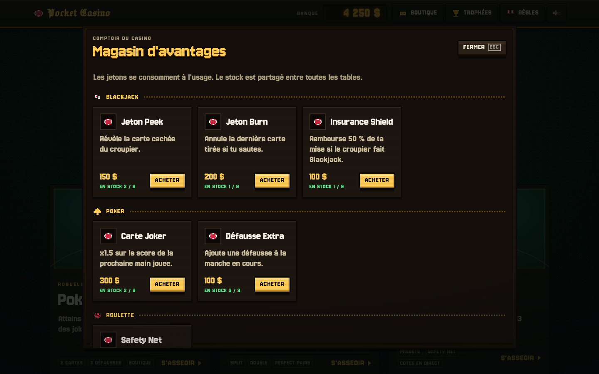

### Écran anti-banqueroute

Il s'ouvre tout seul quand la banque tombe à zéro, mais jamais au milieu d'une manche.

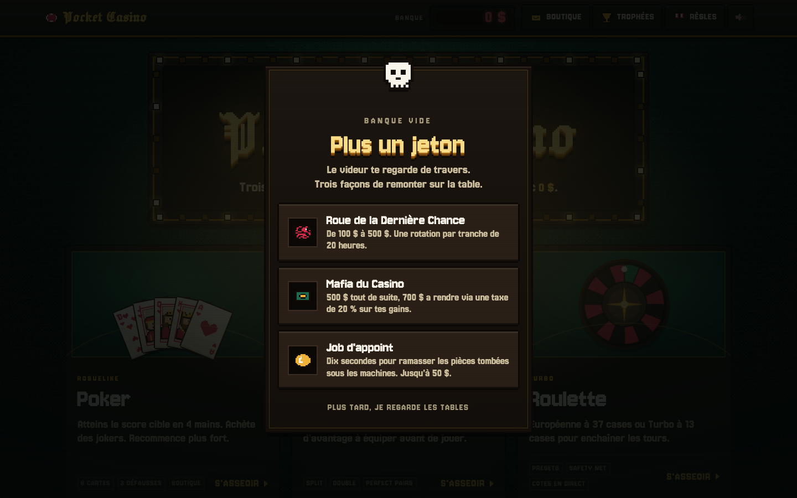

### Sur mobile

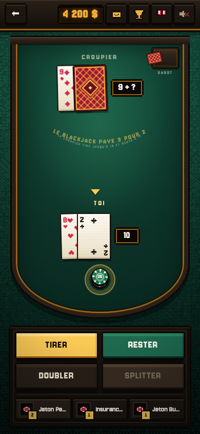

---

## Les trois modes

### Poker roguelike

Inspiré des roguelikes de poker. Chaque manche impose un score cible.

| Élément         | Valeur                                                                 |
| --------------- | ---------------------------------------------------------------------- |
| Main de départ  | 8 cartes                                                               |
| Mains jouables  | 4 par manche                                                           |
| Défausses       | 3 par manche                                                           |
| Cartes par coup | 1 à 5                                                                  |
| Cibles par ante | 300, 450, 700, 1 100, 1 700, 2 600, 4 000, 6 200, puis x1.65           |
| Buy-in          | 100 $ à l'ante 1, plus 50 $ par ante                                   |
| Récompense      | 250 $ à l'ante 1, plus 150 $ par ante, plus 40 $ par main non utilisée |

Le score d'une main vaut `jetons x multiplicateur`. Les jetons viennent de la combinaison, plus la
valeur de chaque carte qui marque. Seules les cartes de la combinaison rapportent : dans une paire,
les trois autres cartes posées ne comptent pas.

Entre deux manches, la boutique propose trois jokers tirés au sort et l'amélioration du niveau des
mains. Dix jokers existent, du simple `+4 Mult` au `x2 Mult sur la dernière main de la manche`.

### Blackjack arcade

Règles de casino classiques : le croupier tire jusqu'à 16 et reste dès 17, y compris sur un 17
souple. Le blackjack naturel paye 3 pour 2, la victoire simple 1 pour 1, l'égalité rembourse.

Ajouts arcade :

- Trois jetons d'avantage utilisables en cours de main : Peek, Burn, Insurance Shield.
- Le split va jusqu'à quatre mains, chacune avec sa mise propre.
- Pari secondaire Perfect Pairs à 10 $.

Note sur Perfect Pairs : le cahier des charges initial prévoyait un gain forfaitaire de x10. La
table implémentée est celle des vrais casinos, à trois paliers (paire mixte x6, paire de même
couleur x12, paire parfaite x25), dont l'espérance tourne autour de x10 mais qui rend le pari
beaucoup plus lisible et plus excitant. Le détail est affiché sur la case de mise et dans le carnet
de règles.

### Turbo roulette

Deux tables au choix :

| Table      | Cases | Numéro plein | Douzaines et colonnes |
| ---------- | ----- | ------------ | --------------------- |
| Européenne | 37    | 35 contre 1  | oui                   |
| Turbo      | 13    | 11 contre 1  | non                   |

Le bouton `Sauver ce preset` mémorise le tapis complet. Un clic sur un preset repose toutes les
mises d'un coup, y compris le choix de la table.

Le jeton Safety Net rembourse 50 % du tapis quand la bille tombe sur le zéro et qu'aucune mise ne
passe.

---

## Économie et progression

La banque démarre à 1 000 $. Toutes les tables et la boutique y puisent.

### Quand la banque tombe à zéro

Trois portes de sortie, chacune avec son coût :

| Option                       | Gain                        | Contrepartie                                        |
| ---------------------------- | --------------------------- | --------------------------------------------------- |
| Roue de la Dernière Chance   | 100 $ à 500 $               | Une seule rotation par tranche de 20 heures         |
| Emprunt à la Mafia du Casino | 500 $ immédiats             | 700 $ à rendre via une taxe de 20 % sur chaque gain |
| Job d'appoint                | 5 $ par pièce, jusqu'à 50 $ | Dix secondes de réflexes                            |

Les lots de la roue sont pondérés : les petits sortent bien plus souvent que les gros, ce qu'un
test vérifie explicitement.

Tant que la dette court, un bandeau rouge reste affiché en haut de l'écran et chaque gain est
amputé de 20 % jusqu'au remboursement intégral.

### Magasin d'avantages

Les bonus s'achètent avec l'argent de la banque, avant ou pendant la partie. C'est ce qui les rend
stratégiques plutôt que gratuits.

| Jeton            | Prix  | Effet                                                   |
| ---------------- | ----- | ------------------------------------------------------- |
| Peek             | 150 $ | Révèle la carte cachée du croupier                      |
| Burn             | 200 $ | Annule la dernière carte tirée quand tu dépasses 21     |
| Insurance Shield | 100 $ | Rembourse 50 % de la mise si le croupier fait blackjack |
| Carte Joker      | 300 $ | x1.5 sur le score de la prochaine main de poker         |
| Défausse Extra   | 100 $ | Une défausse de plus dans la manche en cours            |
| Safety Net       | 250 $ | Sur un zéro à la roulette, 50 % du tapis revient        |

L'Insurance Shield ne se consomme que s'il se déclenche vraiment.

---

## Quitte ou Double

Après chaque manche gagnée, quel que soit le mode, un gros bouton clignotant propose de remettre
en jeu **la totalité du retour de la manche**, mise comprise.

Une carte face cachée, un choix : rouge ou noir.

- Bonne réponse : le montant double, et tu peux repartir pour un tour.
- Mauvaise réponse : tu perds la totalité de la manche.
- Trois tentatives d'affilée au maximum, soit x2, puis x4, puis x8.

Trois réussites consécutives débloquent le trophée Acrobate du Risk.

---

## Trophées

Chaque succès verse une prime en banque. Les primes de trophée échappent à la taxe de la Mafia.

| Trophée                | Condition                                                    | Prime   |
| ---------------------- | ------------------------------------------------------------ | ------- |
| Roi du Bluff           | Obtenir une quinte flush au poker                            | 1 000 $ |
| Poissard Légendaire    | Perdre un blackjack avec 20 face à un 21 du croupier         | 200 $   |
| Acrobate du Risk       | Réussir 3 Quitte ou Double d'affilée                         | 500 $   |
| Nettoyage de Printemps | Utiliser le jeton Burn pour éviter de sauter                 | 100 $   |
| Du Striker au Clochard | Passer de 5 000 $ à 0 $ dans une seule session               | 300 $   |
| Premier Jeton          | Remporter sa toute première manche                           | 50 $    |
| Le Zéro Absolu         | Voir la bille tomber sur le zéro avec un Safety Net posé     | 250 $   |
| Casse la Banque        | Faire monter la banque à 10 000 $                            | 2 000 $ |
| Dette Payée            | Rembourser intégralement la Mafia du Casino                  | 400 $   |
| Main de Fer            | Valider une manche de poker sans utiliser une seule défausse | 300 $   |

---

## Direction artistique

L'objectif était d'obtenir un rendu qui ne ressemble pas à un gabarit générique. Les choix
concrets :

**Pixel art authentique.** Les 26 sprites du jeu sont de vraies grilles de caractères de 16 par 16,
lisibles directement dans [`src/assets/sprites.ts`](src/assets/sprites.ts) :

```ts
export const SPRITE_HEART = sprite([
  '................',
  '..aaa.....aaa...',
  '.aaaaa...aaaaa..',
  'aaaaaaa.aaaaaaa.',
  // ...
]);
```

Un test valide leurs dimensions, celles des portraits de figures, et interdit toute couleur hors
palette. Le composant `Sprite`
compresse chaque ligne en segments avant de produire le SVG, ce qui divise par cinq environ le
nombre de noeuds à l'écran.

**Quatre matières, pas une de plus.** Feutre émeraude pour les surfaces de jeu, ébène laquée pour
les rails et les panneaux, laiton pour l'unique couleur d'action, ivoire pour les cartes et le
texte. Les jetons de score suivent la convention des roguelikes de cartes : jetons en bleu,
multiplicateur en rouge. Tout est déclaré dans [`src/styles/tokens.css`](src/styles/tokens.css).

**Un feutre tramé, pas un dégradé.** Le fond est peint une fois par taille de fenêtre dans un canvas
basse définition, avec un tramage ordonné de Bayer 4x4 et une fibre de bruit déterministe, puis
agrandi sans lissage (voir [`FeltBackdrop.tsx`](src/components/FeltBackdrop.tsx)). La lumière
tombe d'une lampe suspendue au-dessus de la table.

**Contours pixel aux coins entaillés.** Panneaux, boutons et cartes utilisent quatre ombres nettes,
une par côté : les coins restent vides, ce qui dessine un arrondi d'un pixel d'art sans
`border-radius`. Les boutons sont des plaques de laiton posées sur un socle : la lèvre disparaît
quand on appuie.

**Cartes dessinées, pas typographiées.** Les pips suivent la disposition réelle d'un jeu de cartes,
en trois colonnes, avec les pips de la moitié basse retournés à 180 degrés. Le valet, la dame et le
roi ont leur propre portrait de 18 pixels de large (couronne, barbe, sceptre, rose, épée), dans
[`src/assets/portraits.ts`](src/assets/portraits.ts). Chaque carte a trois couches : une ombre qui
reste posée sur le tapis, une levée qui porte le survol et la sélection, et un vrai retournement 3D.
Au survol, la carte s'incline vers le pointeur.

**Les tables ressemblent à des tables.** Blackjack en demi-lune avec ses mentions imprimées en arc
sur le feutre, un sabot et un cercle de mise où la pile de jetons grandit. Roulette au tapis
authentique : zéro vertical, colonnes « 2:1 » en bout de ligne, douzaines dessous, losanges rouge
et noir. Survoler un pari allume les numéros couverts, le numéro sorti reste marqué, et la bille
s'arrête vraiment sur la case gagnante. Sur téléphone, le tapis se redresse à la verticale.

**Une table, un écran.** À table, l'écran devient une console de hauteur fixe : rien ne
demande de défiler, du grand écran au téléphone de 360 px. Les cartes et la roue se dimensionnent
d'après la hauteur réellement disponible (container queries), le blackjack range ses commandes dans
une console à droite de la table, et sur téléphone la roulette garde le tapis à l'écran et fait
surgir la roue en grand le temps du lancer.

**Le décompte se voit.** Au poker, la main jouée quitte l'éventail et se pose au centre. Chaque carte
qui marque saute et ajoute sa valeur, chaque joker réagit à son tour, puis le total tombe sur la
table et la jauge se remplit. Les montants qui entrent ou sortent de la banque s'envolent du
compteur, et tous les chiffres défilent au lieu de sauter.

**Game juice, avec retenue.** Pluie de jetons en canvas 2D sur les gros gains, tremblement d'écran
discret sur les pertes, enseigne à ampoules en chenillard dans le hall. Les animations d'interface
restent sous 300 ms, avec des courbes de sortie franches. Les mises en page de la main (tri,
défausse, jeu) sont animées avec [Motion](https://motion.dev). Le réglage « Animations réduites »
et la préférence système coupent tout le décor.

**Son entièrement synthétisé.** Voir [`src/audio/sfx.ts`](src/audio/sfx.ts) : oscillateurs carrés
façon puce 8 bits pour les jingles, bruit blanc filtré en passe-bande pour les cartes qui glissent
et les jetons en céramique, un tic qui monte d'un demi-ton à chaque carte qui marque. Le contexte
audio ne se crée qu'au premier geste de l'utilisateur.

**Typographie.** Jacquard 24, un gothique pixel, réservé à l'enseigne « Pocket Casino ». Jersey 10,
gros pixels condensés, pour les titres, les boutons et les chiffres. Jersey 25, grille plus fine,
pour le texte courant. Les trois polices sont auto-hébergées en woff2 et gèrent les capitales
accentuées.

---

## Architecture du code

```
src/
├── engine/          Logique pure, sans React, entièrement testée
│   ├── rng.ts           Générateur déterministe mulberry32
│   ├── cards.ts         Cartes, jeu de 52, sabot de blackjack
│   ├── poker.ts         Détection de main et calcul de score
│   ├── jokers.ts        Catalogue et application des jokers
│   ├── pokerRun.ts      Paramètres des antes
│   ├── blackjack.ts     Valeurs, règlement, stratégie de base
│   ├── roulette.ts      Roues, mises, cotes, résolution
│   ├── economy.ts       Banque, taxe Mafia, roue de secours
│   ├── items.ts         Catalogue des jetons spéciaux
│   └── trophies.ts      Catalogue des succès
├── store/           État partagé (Zustand)
│   ├── useCasino.ts     Banque, dette, inventaire, trophées, persistance
│   ├── useToasts.ts     Notifications
│   └── useJuice.ts      Pluie de jetons, tremblement, manche en cours
├── components/      Briques d'interface réutilisables
├── screens/         Un écran par mode, plus boutique, trophées, règles
├── audio/sfx.ts     Synthèse sonore Web Audio
├── assets/          Sprites, portraits de figures et polices
└── styles/          Feuilles CSS par domaine
```

Le principe directeur : **toute la logique de jeu vit dans `engine/`, en fonctions pures**. Aucun
composant React ne calcule un score, une cote ou un règlement. C'est ce qui rend la suite de tests
possible sans monter le DOM, et c'est ce qui permet au carnet de règles d'afficher une table de
stratégie générée par le moteur lui-même.

L'écran anti-banqueroute ne surgit jamais au milieu d'un coup : chaque écran de jeu déclare une
manche en cours via `useRoundActive`, et le panneau attend son tour.

---

## Tests

99 tests unitaires sur le moteur, l équilibrage et les sprites.

```bash
npm test              # exécution unique
npm run test:watch    # mode surveillance
npm run test:coverage # avec rapport de couverture
```

Ce que les tests couvrent réellement :

- **Poker** : la roue basse A-2-3-4-5 compte comme une suite, Q-K-A-2-3 non ; seules les cartes de
  la combinaison marquent ; les modificateurs additifs s'appliquent avant les multiplicatifs.
- **Blackjack** : gestion des As multiples, règlement 3 pour 2, main sautée perdante même quand le
  croupier saute aussi, cohérence de la stratégie de base.
- **Roulette** : 37 cases distinctes, 18 rouges et 18 noirs, le zéro fait tomber toutes les chances
  simples, le Safety Net ne se déclenche que sur un zéro totalement perdant.
- **Économie** : la taxe Mafia ne prend jamais plus que la dette restante, la roue reste dans la
  fourchette 100 $ à 500 $ promise au joueur, les petits lots sortent au moins trois fois plus que
  les gros.
- **Générateur** : même graine, même suite ; un mélange ne perd ni ne duplique de carte et ne
  modifie pas le tableau d'origine.
- **Sprites** : lignes de largeur homogène, grille de 16 par 16, aucune couleur hors palette.
- **Équilibrage** : une simulation joue des manches entières avec une stratégie raisonnable, puis
  vérifie la courbe de difficulté. L'ante 1 doit passer plus de 3 fois sur 4 sans aucun achat,
  l'ante 2 rester serré, l'ante 4 devenir inatteignable sans passer par la boutique. Si un jour le
  barème des mains ou les cibles bougent, ces tests disent immédiatement dans quel sens.

---

## Intégration et déploiement continus

Trois workflows GitHub Actions.

### [`ci.yml`](.github/workflows/ci.yml)

Sur chaque push et chaque pull request, en matrice Node 20 et Node 22 :

1. Vérification du formatage Prettier
2. Lint ESLint
3. Vérification des types TypeScript
4. Tests unitaires avec couverture
5. Compilation du bundle de production
6. Publication de la couverture et du bundle en artefacts

Un second job installe Chromium et rejoue les captures pour vérifier que le rendu ne casse pas.

### [`deploy.yml`](.github/workflows/deploy.yml)

Sur push vers `main`, compile avec le bon chemin de base et publie sur GitHub Pages. La
concurrence est configurée pour ne jamais interrompre un déploiement en vol, ce qui laisserait le
site cassé.

Pour activer le déploiement : dans les réglages du dépôt, section Pages, choisir la source
`GitHub Actions`.

### [`refresh-screenshots.yml`](.github/workflows/refresh-screenshots.yml)

Déclenchement manuel. Régénère les captures et ouvre une pull request si le rendu a bougé.

### Dependabot

Mises à jour npm hebdomadaires groupées en deux lots, outillage de développement d'un côté et
dépendances de production de l'autre, plus une passe mensuelle sur les actions GitHub.

---

## Scripts npm

| Commande                | Rôle                                                      |
| ----------------------- | --------------------------------------------------------- |
| `npm run dev`           | Serveur de développement Vite                             |
| `npm run build`         | Vérification des types puis bundle de production          |
| `npm run preview`       | Sert le bundle compilé                                    |
| `npm run lint`          | ESLint sur tout le dépôt                                  |
| `npm run lint:fix`      | ESLint avec correction automatique                        |
| `npm run format`        | Formate avec Prettier                                     |
| `npm run format:check`  | Vérifie le formatage sans rien modifier                   |
| `npm run typecheck`     | Vérification des types seule                              |
| `npm test`              | Suite de tests                                            |
| `npm run test:watch`    | Tests en mode surveillance                                |
| `npm run test:coverage` | Tests avec rapport de couverture                          |
| `npm run screenshots`   | Régénère `screenshots/` (nécessite `npm run build` avant) |

---

## Accessibilité et confort

- Toutes les commandes sont des vrais éléments `button`, atteignables au clavier, avec un contour
  de focus doré très visible.
- Les cartes, les jetons et les pictogrammes porteurs de sens ont un libellé accessible : une carte
  annonce `Roi de Pique`, pas `carte`.
- Les modales gèrent la touche Échap, la fermeture au clic extérieur et le rôle `dialog`.
- Les notifications sont dans une région `aria-live="polite"`.
- `prefers-reduced-motion` est respecté automatiquement, et un bouton `Animations réduites` dans le
  pied de page permet de couper le tremblement d'écran et la pluie de jetons à la demande.
- Raccourcis clavier aux tables : au poker, `1` à `8` sélectionnent les cartes, `Entrée` joue la
  main et `D` défausse ; au blackjack, `T` tire, `R` reste, `D` double, `S` splitte et `Entrée`
  distribue. Les touches sont rappelées sur les boutons quand un pointeur fin est présent.
- Le son se coupe en un clic depuis la barre du haut, et le choix est mémorisé.
- La mise en page tient de 390 px de large jusqu'aux grands écrans.

---

## Conventions du dépôt

- **Encodage** : tous les fichiers texte sont en UTF-8 sans BOM, avec des fins de ligne LF. C'est
  imposé par [`.editorconfig`](.editorconfig) et [`.gitattributes`](.gitattributes), et vérifié par
  Prettier en CI.
- **Identifiants en ASCII** : les clés de type, les identifiants et les noms de fichiers restent
  sans accent. Seuls les libellés affichés sont accentués. Par exemple la clé de roue est
  `europeenne` mais son libellé est `Européenne`.
- **Pas d'emoji** dans le code, l'interface ou la documentation. Les pictogrammes sont des sprites
  pixel art maison.
- **Aucun asset binaire** en dehors des deux polices et des captures d'écran.

---

## Licence

MIT. Voir [LICENSE](LICENSE).

Jeu de divertissement uniquement. Aucun argent réel, aucun achat intégré, aucune publicité, aucune
collecte de données : la progression ne quitte jamais le navigateur.
